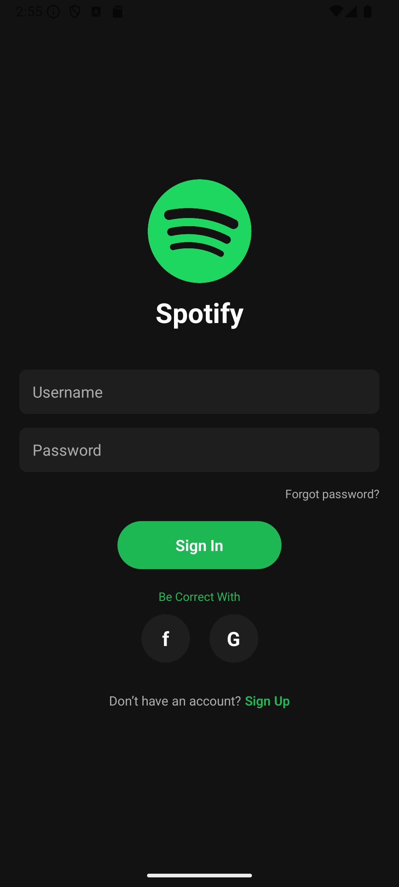
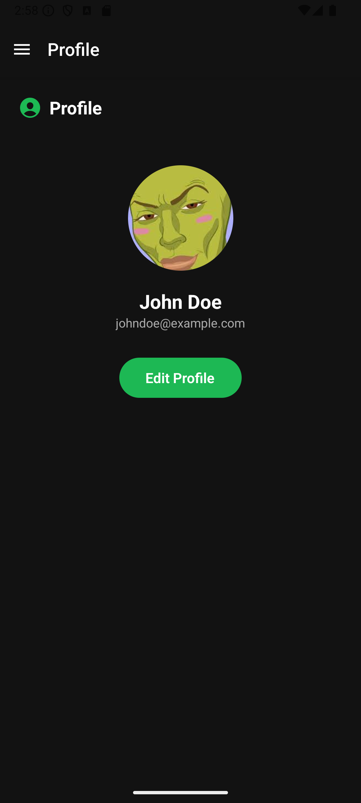
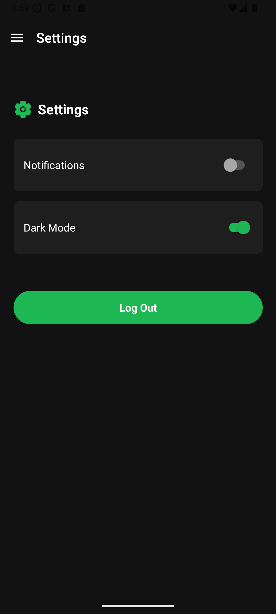
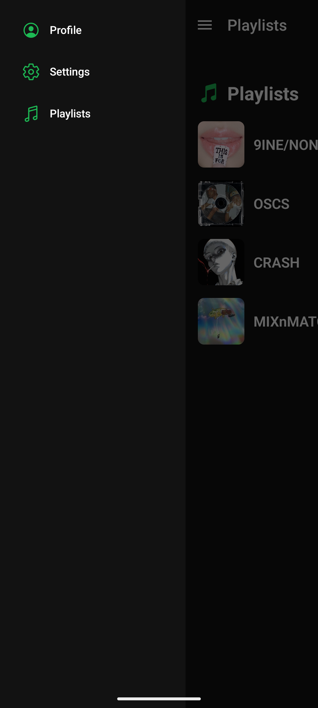

# AdvMobDev  

This repository contains my first project in the **Advanced Mobile Software Development** course.  
It is a prototype mobile application built with **React Native** and **Expo Router**, featuring Spotify-inspired screens and navigation patterns.  

---

## 📱 Screenshots  

- Login Screen  
    

- Sign Up Screen  
    

- Profile Screen  
    

- Settings Screen  
    

- Playlists Screen  
    

- Drawer
    

---

## 🧭 Navigation Flow  
The application uses a **stack navigator** for the authentication flow (Login and Sign Up), while a **custom drawer navigator** manages access to the main screens (Profile, Settings, and Playlists).  
Users start at the Login screen, can register via the Sign Up screen, and once authenticated, they gain access to the drawer-based main app.  
The drawer features smooth **animated slide-in transitions** powered by `react-native-reanimated`.  
For accessibility, intuitive labels, consistent iconography, and touch-friendly buttons ensure the app is easy to navigate for all users.  

---

## ⚙️ Tech Stack  
- React Native  
- Expo Router  
- @react-navigation/drawer  
- react-native-reanimated  
- @expo/vector-icons  

---

## 📌 Notes  
- This is a prototype project created for educational purposes.  
- Future improvements may include API integration, persistent login, and user profile editing.  
